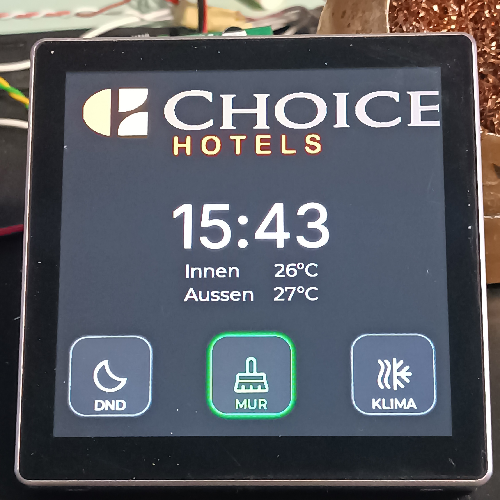
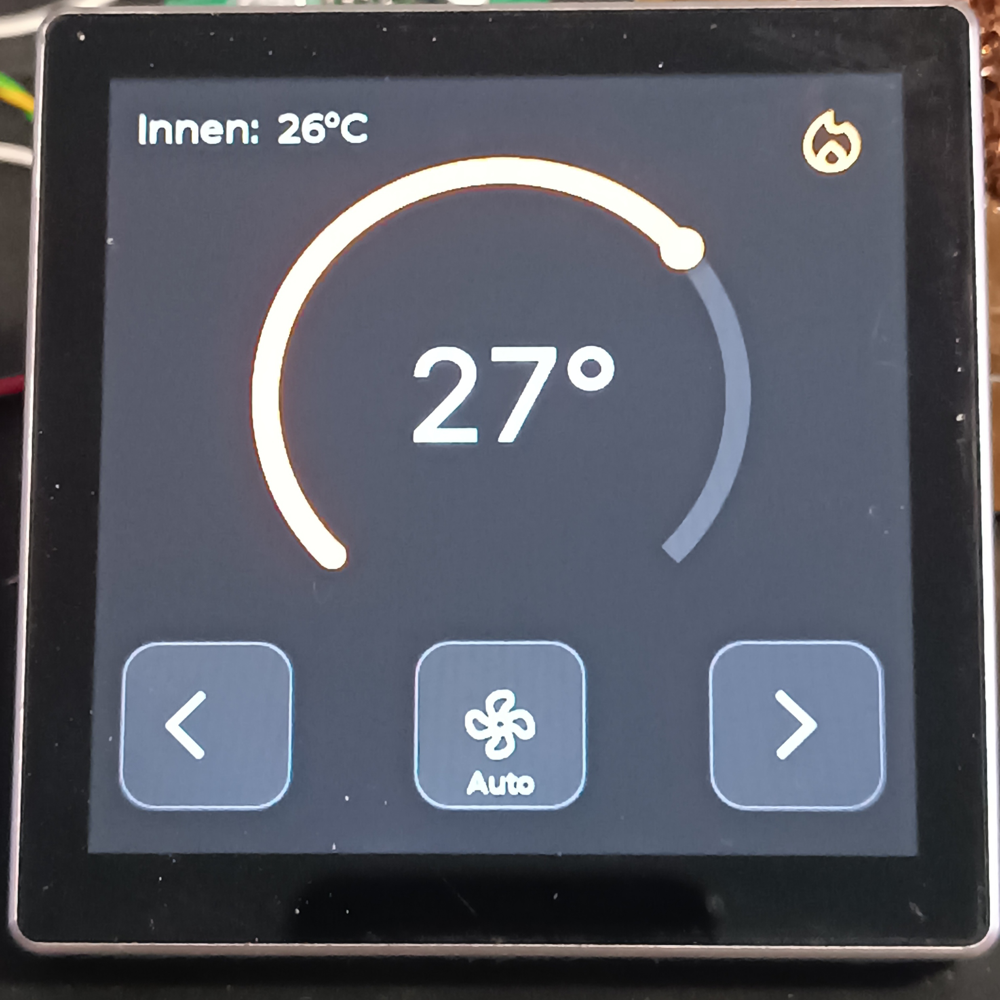
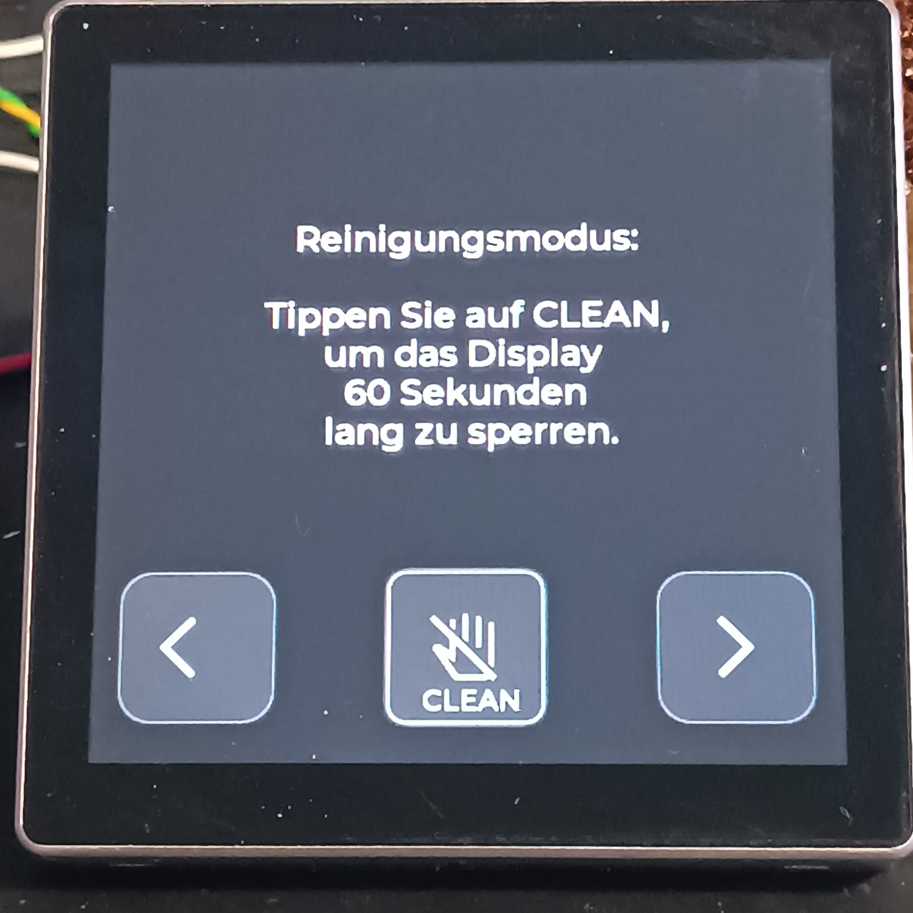
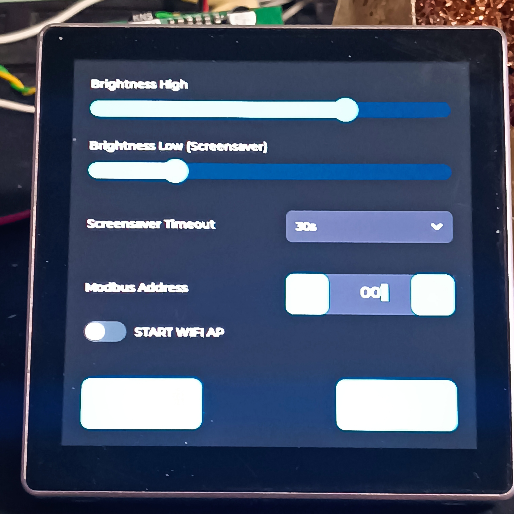
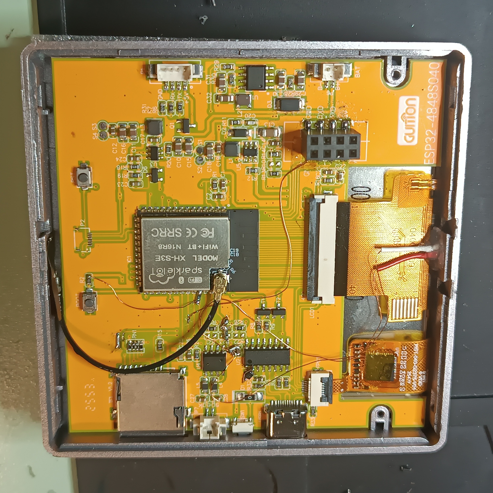
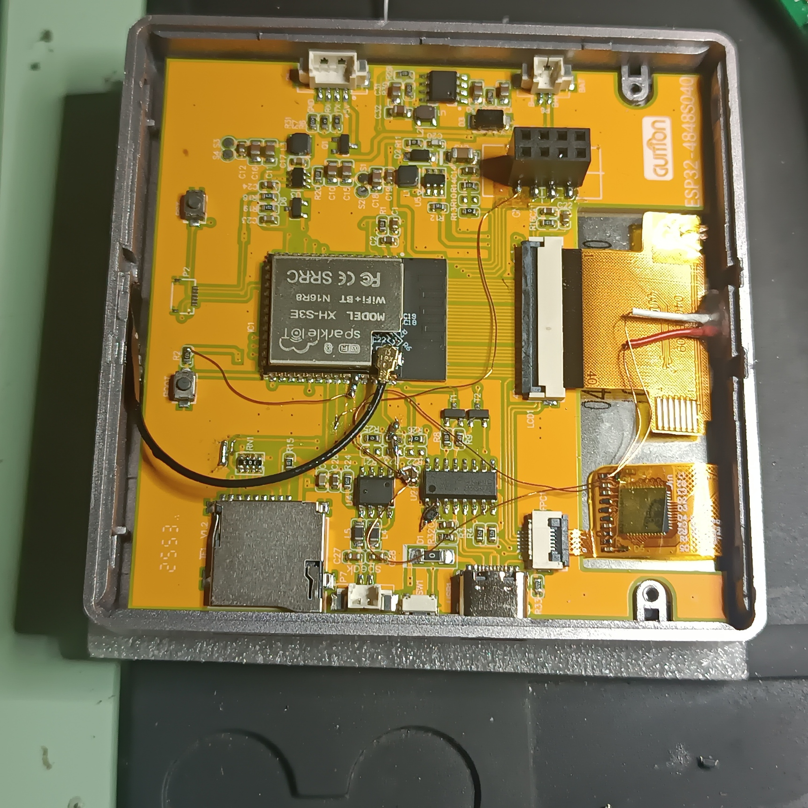

# Hotel Room Thermostat

A complete hotel room thermostat and room-status controller built as a polished, deployment-ready product for modern hospitality environments. The device combines an elegant touchscreen interface, a custom PCB expansion/interfacing board, robust RS485/Modbus connectivity, and practical service features that make it suitable for real hotel installations.

This project goes far beyond a simple ESP-based display thermostat. It is a compact and visually refined in-room controller designed to deliver comfort control, room-status signaling, hotel-system integration, branding flexibility, and maintainable field service access in one finished device.

## Product Overview

The unit is designed as a complete room controller for hotel applications, bringing together HVAC control, housekeeping signaling, guest-facing interaction, and backend integration in a single wall-mounted device.

Core product capabilities:

- room temperature control for heating and cooling
- setpoint adjustment and fan-speed control
- time and system-status display
- **DND** (*Do Not Disturb*) function
- **MUR** (*Make Up Room*) / housekeeping call function
- elegant guest-facing GUI optimized for hotel interiors
- hotel logo upload through the web interface
- firmware update through the web interface
- Wi‑Fi connectivity for service and network-assisted features
- periodic time refresh over the network when the device does not receive a time-sync packet from the hotel system
- **RS485 / Modbus** integration with supervisory or hotel management systems

## GUI Gallery

<table>
  <tr>
    <td></td>
    <td></td>
  </tr>
  <tr>
    <td></td>
    <td></td>
  </tr>
</table>

The interface is intentionally calm, clean, and visually premium. It feels comfortable and intuitive in daily use, while still exposing the right controls and room-status information at a glance. That balance is especially important in hospitality products, where the interface must be both guest-friendly and operationally practical.

## Hardware Platform

The product is built around an **ESP32-S3 4848S040** touchscreen platform with a 4.0" display, extended by a purpose-designed **PCB interface board** that turns a low-cost module into a much more capable hotel-grade controller.

The custom interface hardware includes:

- an **I2C expander** for additional I/O capacity
- a **flicker-free** interface approach for stable visual and output behavior
- an **RS485 driver** for reliable field communication
- dedicated interfacing for room-control and hotel-system signals

This hardware layer is a key part of the product, because it bridges the gap between an affordable display module and a fully integrated wall thermostat suitable for hospitality use.

## Engineering Workarounds and Hardware Adaptation

A particularly interesting part of the project is how the limitations of the low-cost ESP display platform were solved with thoughtful hardware adaptation, making the final device significantly more capable than the base module.

### Temperature Measurement Adaptation

Because the original display module does not include a built-in temperature sensor, a small hardware modification was introduced to enable real room-temperature measurement. This transforms the unit from a visual control panel into a true room thermostat capable of meaningful environmental control.

### Shared Serial Interface Adaptation

An additional serial-line workaround was implemented so that both of the following can operate in parallel:

- **USB-C programming / service access**
- **Modbus / RS485 communication**

This makes the device far more practical during both development and field servicing, since engineering access and system communication can coexist without sacrificing one for the other.

### Hardware Modification Photos

<table>
  <tr>
    <td></td>
    <td></td>
  </tr>
</table>

## Communication and System Integration

Communication is one of the strongest aspects of this device.

The hardware includes an **RS485 driver**, and the firmware implements a complete **Modbus** stack with support for both:

- **read functions**
- **write functions**

This allows the thermostat to exchange commands, room status, configuration values, and operating data with supervisory systems, hotel controllers, or building-management infrastructure.

The result is a room device that is not only attractive on the wall, but also ready for serious systems integration.

## Software Features

The firmware combines guest-facing usability with service-oriented flexibility.

Implemented software features include:

- modern touchscreen GUI built on the LVGL ecosystem
- local room comfort control
- storage of configuration and runtime settings
- room-status handling for hotel workflows
- custom hotel logo upload
- web-based firmware update
- Wi‑Fi connectivity for service and support functions
- periodic network time synchronization fallback when hotel-system time sync is unavailable

These features make the platform suitable both for direct deployment and for OEM customization.

## Repository Structure

- `fw/` — firmware for the ESP32-S3 device
- `hw/` — hardware design and PCB project for the interface board
- `sw/` — GUI / SquareLine Studio project and UI resources
- `doc/` — GUI images, hardware modification photos, and supporting project assets

## Development Stack

- **MCU platform:** ESP32-S3
- **Firmware framework:** Arduino / PlatformIO
- **GUI framework:** LVGL + SquareLine Studio
- **Communication:** RS485 + Modbus
- **Storage / assets:** LittleFS and web-uploaded resources
- **Hardware design:** custom PCB interface board

## Why This Project Stands Out

This project is a strong example of turning a low-cost ESP touchscreen module into a refined and deployment-ready hospitality product.

What makes it stand out is the combination of:

- a visually pleasing and polished user interface
- real hotel-room functionality such as **DND** and **MUR**
- custom hardware that extends the platform in a meaningful way
- industrial-style field communication through **RS485 / Modbus**
- practical engineering workarounds that solve real hardware limitations
- branding and service features such as logo upload and web firmware updates

The final result is a compact, elegant, and highly functional room controller that feels complete as a product, not just as a prototype.
