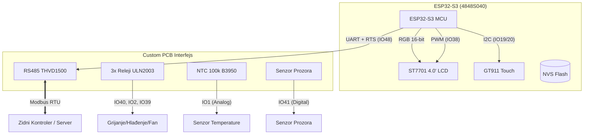
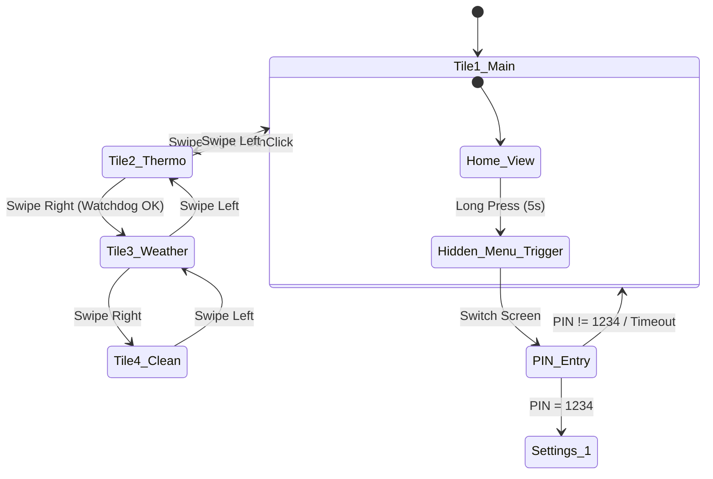
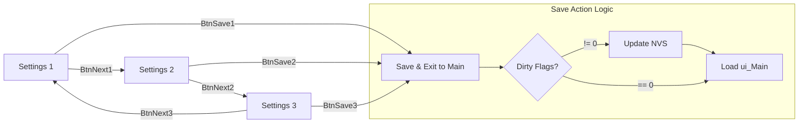
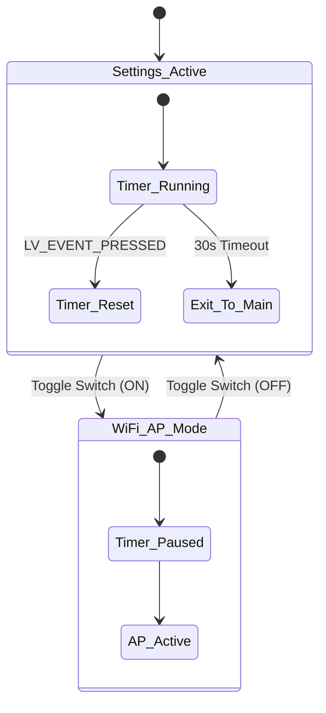
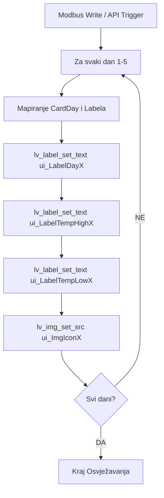

# SISTEMSKI DIJAGRAMI (Mermaid)
Ovi dijagrami vizualizuju arhitekturu i logiku definisanu u FSD.md (v3.0).

---

## 1. Arhitektura Sistema (Block Diagram)
Prikazuje vezu između ESP32-S3, Custom PCB-a i vanjskih elemenata.

---

## 2. Navigacija Glavnog Interfejsa (TileView)
Glavni interfejs koristi horizontalni `ui_SwipeContainer`.

---

## 3. Kružna Navigacija Postavki (Settings Menu)
Prikazuje kretanje između tri ekrana postavki sa Save/Exit logikom.

---

## 4. Inactivity Timeout i WiFi Manager Logic
Prikazuje kako WiFi Manager suspenduje automatski povratak na glavni ekran.

---

## 5. Weather UI Update Flow
Ažuriranje 5 statičkih kartica na osnovu novih podataka.

