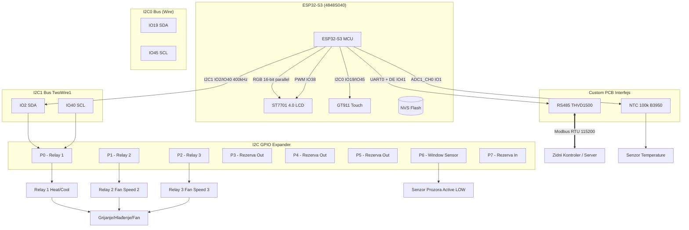
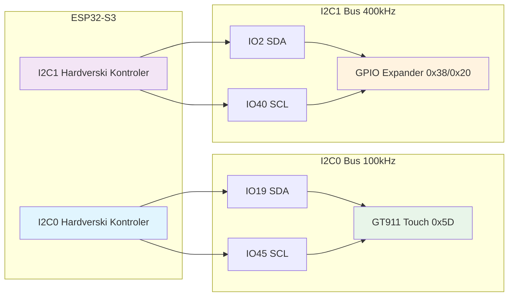
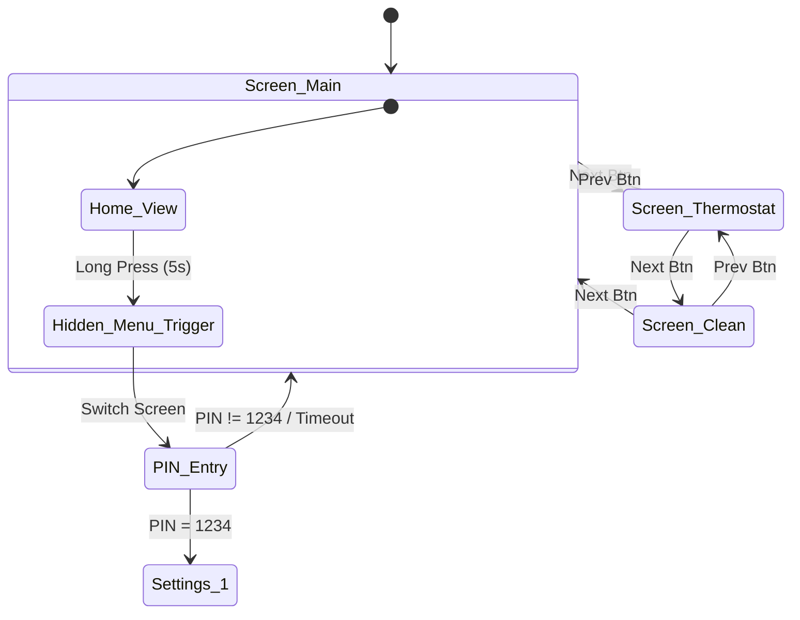
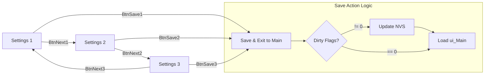
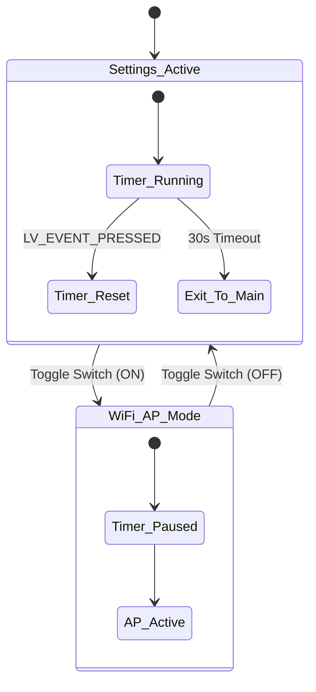
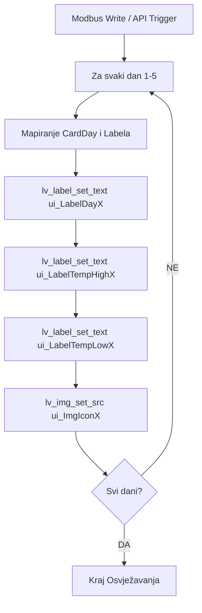
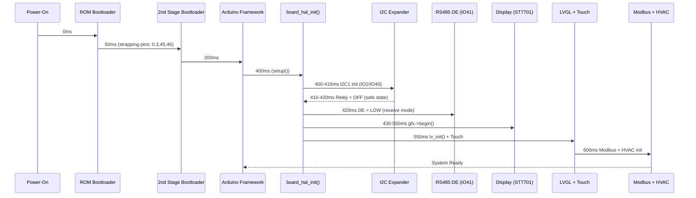
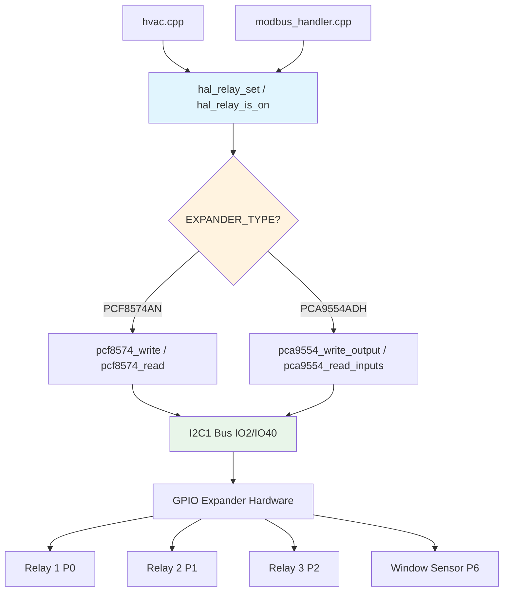

# SISTEMSKI DIJAGRAMI (Mermaid)
Ovi dijagrami vizualizuju arhitekturu i logiku definisanu u FSD.md (v4.0 — I2C Expander).

---

## 1. Arhitektura Sistema (Block Diagram)
Prikazuje vezu između ESP32-S3, I2C GPIO Expandera, Custom PCB-a i vanjskih elemenata.

---

## 2. Dual I2C Bus Arhitektura
Prikazuje nezavisne I2C0 i I2C1 kontrolere na ESP32-S3.

---

## 3. Navigacija Glavnog Interfejsa (Beskonačna Petlja / Nezavisni Ekrani)
Glavni interfejs koristi tri nezavisna ekrana povezana navigacionim dugmadima (bez SwipeContainer-a).

---

## 4. Kružna Navigacija Postavki (Settings Menu)
Prikazuje kretanje između tri ekrana postavki sa Save/Exit logikom.

---

## 5. Inactivity Timeout i WiFi Manager Logic
Prikazuje kako WiFi Manager suspenduje automatski povratak na glavni ekran.

---

## 6. Weather UI Update Flow
Ažuriranje 5 statičkih kartica na osnovu novih podataka.

---

## 7. Boot Sekvenca sa I2C Expanderom
Timeline od power-on-a do potpuno funkcionalnog sistema.

---

## 8. I2C Expander Adapter API — Pozivni Lanac
Kako `hvac.cpp` i `modbus_handler.cpp` komuniciraju sa relejima kroz adapter sloj.

